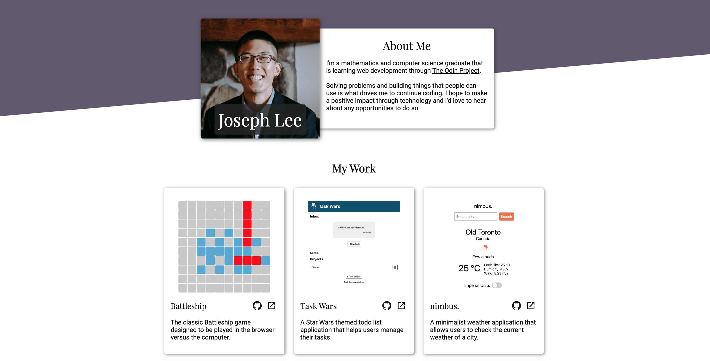

# Homepage

My personal website, with the design inspired by the [homepage project](https://www.theodinproject.com/lessons/node-path-advanced-html-and-css-homepage) from [The Odin Project](https://www.theodinproject.com/). I focused on making this website responsive so it should look great on any screen size. Take a look at the [live website](https://jooo-lee.github.io/homepage/)!

## I learned how to:

-   Apply the `transform` property to change the appearance of elements without affecting the natural document flow
-   Enhance the user experience by using the `transition` property
-   Provide meaning and context through semantic HTML
-   Ensure sufficient color contrast ratios to provide an easily perceivable website for visually impaired users
-   Enforce proper tab order and focus styles while ensuring that a user is able to navigate using a keyboard
-   Provide meaningful `alt` attributes for images
-   Provide additional descriptive text using the `aria-label` attribute
-   Incorporate natural responsiveness by utilizing the viewport meta tag along with CSS Flexbox and CSS Grid
-   Serve up different images based on screen size
-   Restyle elements based on user's screen size

## Acknowledgements:

[Playfair Display font](https://fonts.google.com/specimen/Playfair+Display?query=playfair+display) and [Roboto font](https://fonts.google.com/specimen/Roboto?query=roboto) from [Google Fonts](https://fonts.google.com/).

GitHub and LinkedIn icons from [Devicon](https://devicon.dev/).

[External link icon](https://pictogrammers.com/library/mdi/icon/open-in-new/) from [Pictogrammers](https://pictogrammers.com/).

[Stormtrooper image](https://unsplash.com/photos/selective-focus-photography-of-star-wars-stormtropper-minifigure-on-sand--oM_twQDw2Y) from [Unsplash](https://unsplash.com/).
